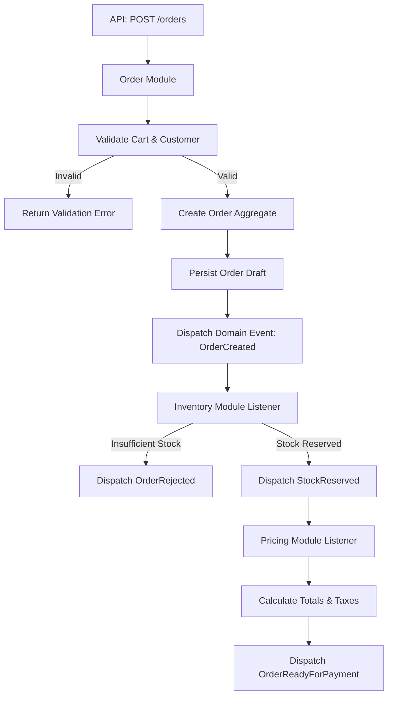

# Order flow

Order placement crosses several modules: the Order module coordinates, and
Inventory (stock reservation) reacts to the events it dispatches.

The order then waits for payment — see the
[order state machine](/architecture/flows/order-state-machine) for the
possible transitions and the [payment flow](/architecture/flows/payment-flow)
for how the order becomes paid.
