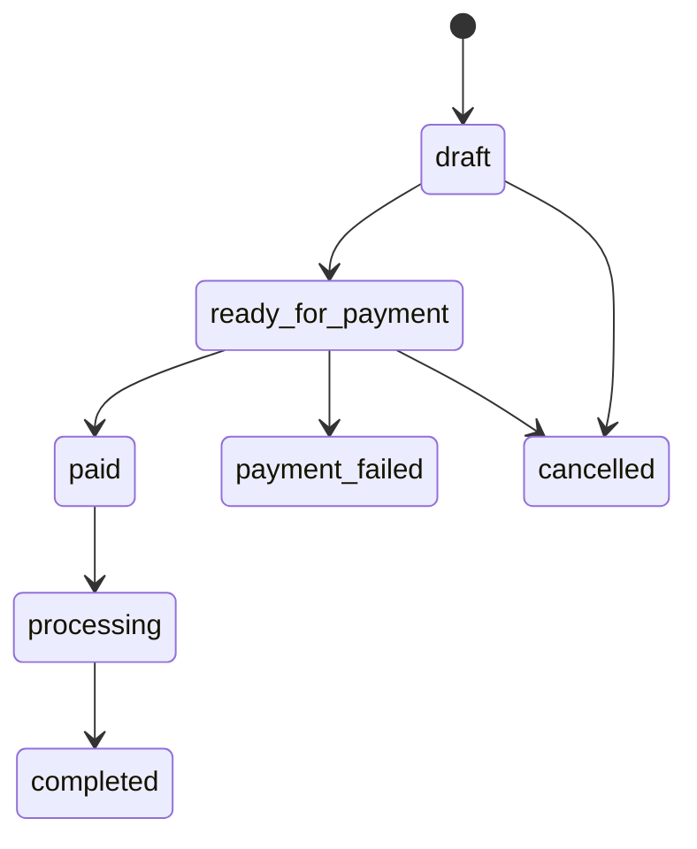

# Order state machine

Every order moves through a guarded state machine. Payment failure,
cancellation, and completion are all explicit transitions — no order jumps
states implicitly.

The Shipping module mirrors its own shipment lifecycle onto this machine:
when a shipment reaches `shipped` the order is marked `SHIPPED`, and when it
reaches `delivered` the order is marked `COMPLETED`
(see [Shipping](/backend/shipping)).
