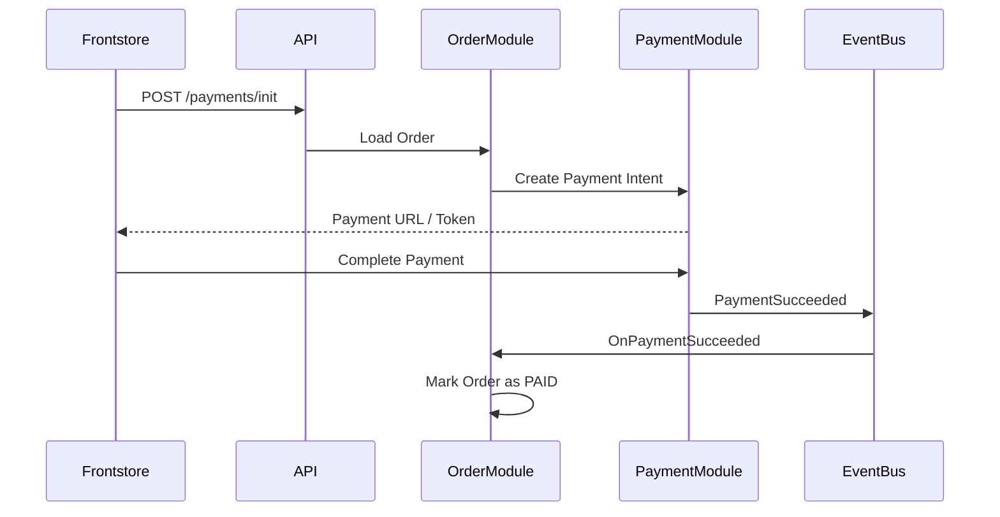

# Payment flow

Payments are **synchronous by default and async-capable**: the storefront
initiates a payment, receives a payment URL/token, completes it at the
provider, and the resulting event updates the order through the event bus.

