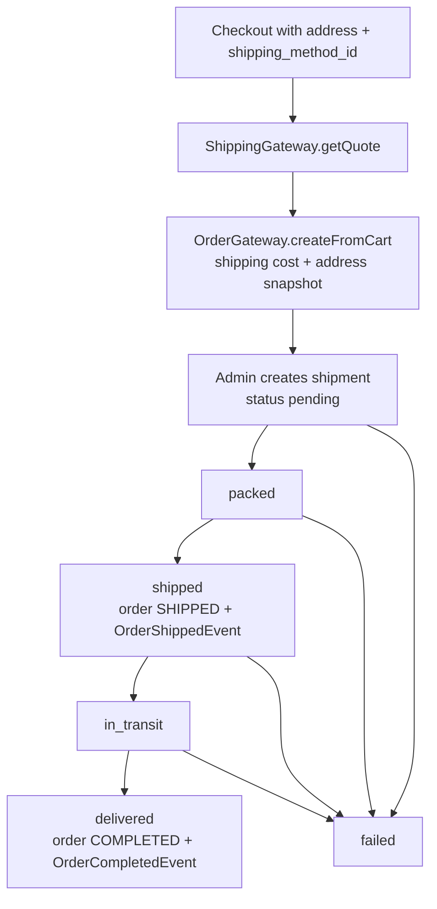

# Shipping

## Purpose

Shipping methods with per-zone flat rates, country-based shipping zones,
and per-order shipments with manual carrier tracking.

## Responsibilities

- Manage translatable shipping methods (code, active flag, position).
- Manage shipping zones and their country coverage — a zone with no
  countries acts as a "rest of world" fallback.
- Manage flat per-zone rates per method (`price = 0.00` means free
  shipping).
- Quote available methods + costs for a country (checkout integration via
  the ShippingGateway).
- Track one shipment per order through a guarded status lifecycle and
  mirror the order status: `shipped` → order `SHIPPED`, `delivered` →
  order `COMPLETED`.

## Tables

| Table                          | Description                                                                                       |
| ------------------------------ | ------------------------------------------------------------------------------------------------- |
| `shipping_methods`             | Shipping methods (unique code, active, position)                                                  |
| `shipping_method_translations` | Per-language name/description of a method                                                         |
| `shipping_zones`               | Admin-facing zones (not translated)                                                               |
| `shipping_zone_countries`      | Pivot: zone ↔ `core_countries.code`                                                               |
| `shipping_rates`               | Flat price per method per zone (unique pair)                                                      |
| `shipping_shipments`           | One shipment per order: carrier, tracking number/URL, status, shipped/delivered timestamps, notes |

## Models

| Model               | Description                                                         |
| ------------------- | ------------------------------------------------------------------- |
| `Method`            | Shipping method with `translations()`                               |
| `MethodTranslation` | Per-language name/description                                       |
| `Zone`              | Zone with `countries()` BelongsToMany to Core's Country             |
| `Rate`              | Price for a method on a zone                                        |
| `Shipment`          | Standalone model — orders are only referenced via the order gateway |

## Events emitted

| Event                    | When                                                  |
| ------------------------ | ----------------------------------------------------- |
| `ShipmentCreatedEvent`   | A shipment is created for an order (status `pending`) |
| `ShipmentShippedEvent`   | Shipment transitions to `shipped`                     |
| `ShipmentDeliveredEvent` | Shipment transitions to `delivered`                   |

Also, through the Order gateway: `OrderShippedEvent` (shipment →
`shipped`) and `OrderCompletedEvent` (shipment → `delivered`).

## Events listened to

| Event                                                                      | Reaction       |
| -------------------------------------------------------------------------- | -------------- |
| `ShipmentCreatedEvent` / `ShipmentShippedEvent` / `ShipmentDeliveredEvent` | `LogAllEvents` |

## Dependencies

| Module | Reason                                                                                    |
| ------ | ----------------------------------------------------------------------------------------- |
| Core   | Contracts (events, gateways, DTOs), `CountryCodeRule`, `core_countries`, default language |
| Order  | `OrderGatewayInterface` (`findOrder`, `markAsShipped`, `markAsDelivered`)                 |
| User   | `UserGatewayInterface::getAddress` for checkout quotes                                    |
| Cart   | Checkout accepts `shipping_method_id` and passes the quote into `createFromCart`          |

## Flow

